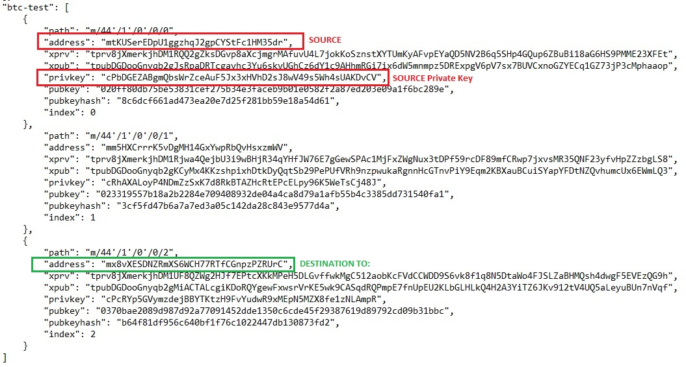
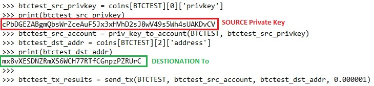
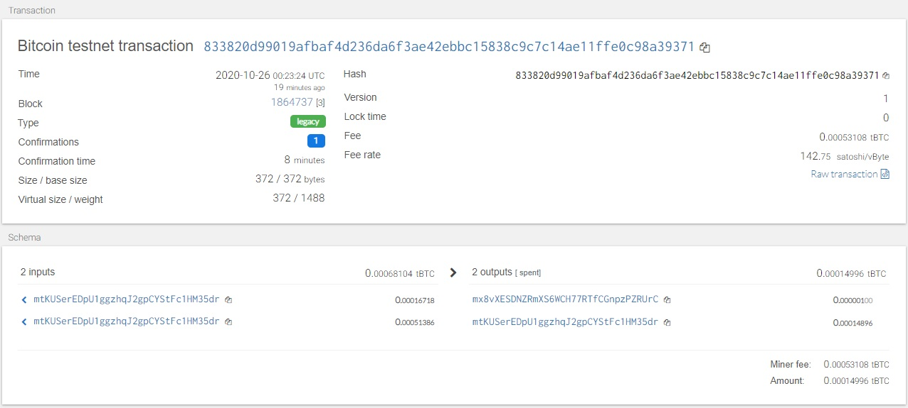
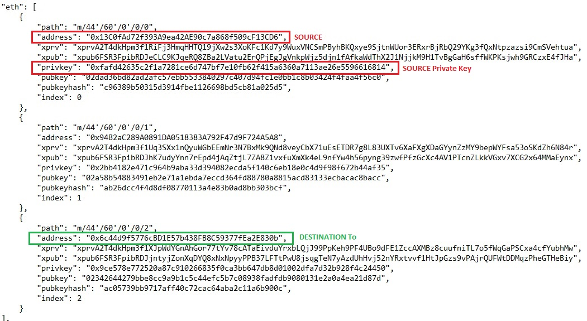
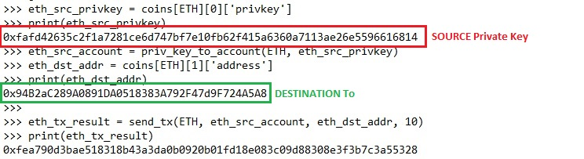
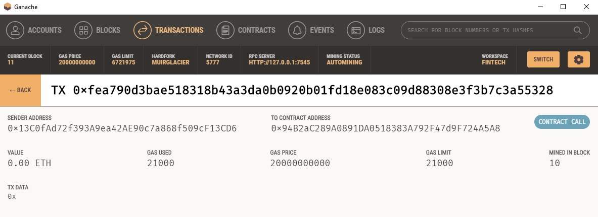

# 19-Blockchain-Python

#### Unit 19 Blockchain-Python Homework - Dan Smith  
* wallet python code : [wallet.py](./wallet/wallet.py)
* constants python code: [constants.py](./wallet/constants.py)

##### About the Wallet:  
  1. The wallet.py script starts by taking in the MNEMONIC environment variable and using the derive_wallets function to generate accounts for each coin specified in constants.py, currently 'eth' and 'btc-test'.  
  2. Once the dervice_wallet is run for each coin type, a dict object named coins stores the private and public key information for each coin type and coin index.  The number of coin instances for each type of coin defaults to 3.
  3. The coin dict and priv_key_to_account function can be used to create coin account object types appropriate for each supported coin.
  3. The send_tx function can then be called to send cryptocurrency of any supported type. The coin type, account object, destination address, and quantity are passed to the funtion to complete each transaction. The send_tx function relies upon a helper function, create_tx to properly pass and format the raw transaction before the send_tx function signs the transaction and commits it to the appropriate blockchain.
  4. In this manner a common interface can be used for generating wallets from a root mnemonic with various coins. Support for new coin types can be added while maintaining a standard interface.

##### Installation Instructions:
Installation requirements for wallet.py  
* To install requirements run the following:
  > pip install requirements.txt 
* hd-wallet-derive requirements:
  > 1. navigate inside the folder path where wallet.py exists.
  > 2. clone the [hd-wallet-derive](https://github.com/dan-da/hd-wallet-derive) repository into this path.
  > 3. You should now have a folder named 'hd-wallet-derive' in the same location as wallet.py
  > 4. Create a symlink to call the hd-wallet-derive code by typing the following in the shell:  
  > * > ln -s hd-wallet-derive/hd-wallet-derive.php derive

##### Summary: Bitcoin TestNet Transactions  
1. Summary of Test Wallets and Accounts:  
    >   

2. Bitcoin TestNet transaction execution:  
    >   

3. Bitcoin TestNet transaction confirmation:  
  >   

##### Summary: ETH Ganache Test Transactions  
1. Summary of Test Wallets and Accounts:  
  > 

2. Ethereum TestNet transaction execution:  
  > 

3. Ethereum TestNet transaction confirmation:  
  > 